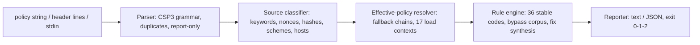

# cspdoctor

[English](README.md) | [中文](README.zh.md) | [日本語](README.ja.md)

[](LICENSE)   [](CONTRIBUTING.md)

**'unsafe-inline'・ワイルドカード・指令の欠落を検出する、オープンソースかつ依存ゼロの Content-Security-Policy リンター —— CSP 専用パーサーとして、すべての検出に実行可能な修正案と安定した終了コードを添える。**


```bash
# not yet on npm — install from a checkout of this repository
npm install && npm run build && npm pack
npm install -g ./cspdoctor-0.1.0.tgz
```

## なぜ cspdoctor？

正しい CSP を書くのは悪名高いほど難しく、しかも失敗は音もなく起きる。文法には罠が多く（引用符を忘れた `unsafe-inline` は決して存在しないホストソースになる。`'none'` は他のソースが並んだ時点で無視される。重複した指令はマージされない）、フォールバックの意味論は直感に反し（`worker-src` は `child-src` *と* `script-src` を順に辿る一方、`base-uri`・`form-action`・`frame-ancestors` は一切フォールバックしない）、厳格に見えるポリシーが実は空回りのまま本番に出ていく。ヘッダースキャナーはヘッダーの存在しか教えてくれず、オンライン評価ツールはデプロイする CI から遠く離れたブラウザータブの中で採点する。cspdoctor は専用・オフラインの CSP パーサー兼ルールエンジンだ。ブラウザーと同じ方法でポリシーを解析し、まず*実効*ポリシーを解決してから、安定コード付きの 36 ルールを実際の悪用可能性で採点する —— `default-src *` はスクリプトを支配する間は error で、より厳しい指令に上書きされれば自動的に降格 —— すべての検出に具体的な修正を添え、パイプラインがそのままゲートにできる終了コードを返す。

|  | cspdoctor | csp-evaluator | Mozilla Observatory | securityheaders.com |
|---|---|---|---|---|
| 焦点 | CSP 専業：解析 + 検査 + 解説 | CSP チェック（Web UI / ライブラリ） | サイト全体の採点 | ヘッダー存在チェック |
| 実行場所 | 手元のターミナルと CI、完全オフライン | ブラウザータブ；ライブラリは JS バンドル内 | ホスティングサービス | ホスティングサービス |
| 実効ポリシー採点（フォールバック連鎖） | あり —— 深刻度はソースが実際に支配する範囲に従う | 部分的 | なし | なし |
| 全検出に修正案付き | あり、コピペ可能 | 部分的 | 一般論の助言 | 一般論の助言 |
| オフラインのルール解説 | `cspdoctor explain <anything>` | なし | Web ドキュメントへのリンク | Web ドキュメントへのリンク |
| CI 用終了コード | 0/1/2、`--fail-on` 対応 | ライブラリの戻り値 | なし | なし |
| ランタイム依存 | 0 | Closure ライブラリ一式 | 対象外（ホスティング） | 対象外（ホスティング） |

<sub>各機能は各プロジェクトの公開ドキュメントに照らして確認、2026-07。</sub>

## 特長

- **ブラウザーと同じ方法で CSP を解析** —— CSP3 のセミコロン/空白文法、大文字小文字の規則、重複は先勝ち。定番の `script-src unsafe-inline`（引用符忘れ）は、実際に化けた死んだホストソースとして検出する（E101）。
- **テキストではなく実効ポリシーを採点** —— 深刻度を割り当てる前にフォールバック連鎖を解決。ワイルドカードはスクリプト・ワーカー・プラグイン・`<base>` を支配する場所では error、データ流出やフレーミングを許す場所では warning、`img-src` では notice。
- **すべての検出に修正案** —— 安定コード付き 36 ルール（E1xx/W2xx/I3xx）。どれもコピペで直せる整備案付きで、キーワードや指令のタイポには did-you-mean が出る。
- **バイパス文献を熟知** —— nonce のエントロピー（W213）、nonce なしの `'strict-dynamic'`（E106）、無効化済み `'unsafe-inline'` の正直な報告（I301）、さらに許可リストを破る JSONP/AngularJS/ユーザーコンテンツ系ホストの精選コーパス（W215）。
- **3 つのサブコマンド** —— `check` は検査。`coverage` は 17 の読み込みコンテキストをどの指令が実際に支配しているかを表示。`explain` は全ルール・指令・キーワードをオフラインで解説。
- **CI のために、依存ゼロで** —— 決定的な出力、`--format json`、`--fail-on error|warning|info|never`、終了コード 0/1/2。必要なのは Node.js だけで、ツールはソケットを一切開かない。

## クイックスタート

インストール：

```bash
# not yet on npm — install from a checkout of this repository
npm install && npm run build && npm pack
npm install -g ./cspdoctor-0.1.0.tgz
```

保存済みレスポンスを検査（`examples/weak.txt` —— ヘッダー名は自動で剥がされる）：

```bash
cspdoctor check --file examples/weak.txt
```

出力（実際の実行記録、12 件の検出から 5 件を抜粋）：

```text
policy 1 (enforced): 5 directives — 5 errors, 4 warnings, 3 info

  error E101 style-src › unsafe-inline
      unsafe-inline has no quotes, so browsers read it as a host named "unsafe-inline" — the keyword is not in effect
      fix: write 'unsafe-inline' (with quotes) if you meant the keyword — then rerun to see what the quoted form implies

  error E110 script-src › 'unsafe-inline'
      'unsafe-inline' lets every injected <script>, event handler and javascript: URL run — it turns off the XSS protection CSP exists to provide
      fix: move inline code to nonced or hashed scripts; once a nonce/hash is present, 'unsafe-inline' becomes a harmless legacy fallback

  error E113 script-src › https:
      https: is not "HTTPS only" — it allows every HTTPS origin on the internet to supply scripts, script elements, event handlers, workers
      fix: replace https: with the specific origins you load from

  warning W215 script-src › ajax.googleapis.com
      ajax.googleapis.com is a known CSP bypass in a script context — it hosts AngularJS and other gadget-rich libraries
      fix: self-host the files you need, or move to nonces + 'strict-dynamic' so the host allowlist stops mattering

  warning W207 base-uri (not set)
      base-uri is not set (it never falls back to default-src) — one injected <base> tag rebases every relative script URL to an attacker's origin
      fix: add: base-uri 'none' (or base-uri 'self' if you use <base>)

cspdoctor: FAIL — 5 errors, 4 warnings, 3 info (fail-on: warning)
```

終了コード 1 —— そのまま CI に投入できる。厳格 CSP の双子 `examples/strict.txt` は、無意味に見えるソースが*なぜ*正しいのかを説明する info 2 件だけを添えて 0 で終了する。各読み込みコンテキストを実際に誰が支配しているかを見るには（実際の実行記録、抜粋）：

```bash
cspdoctor coverage "default-src 'self'; script-src 'nonce-Xu3Xkw5rlPX2Jkyu' 'strict-dynamic'"
```

```text
effective coverage (policy 1)

  directive        governed by     sources
  script-src       script-src      'nonce-Xu3Xkw5rlPX2Jkyu' 'strict-dynamic'
  ...
  worker-src       -> script-src   'nonce-Xu3Xkw5rlPX2Jkyu' 'strict-dynamic'
  object-src       -> default-src  'self'
  base-uri         (unset)         unrestricted
  ...
  form-action      (unset)         unrestricted
  frame-ancestors  (unset)         unrestricted (header-only directive)
```

その他のシナリオ（レガシー許可リストポリシー、CI ゲートスクリプト）は [examples/](examples/README.md) に。

## ルール

Error（E1xx）はポリシーが字面より弱い、あるいは XSS の扉が開いたままであることを意味する。warning（W2xx）はブラウザーが何かを無視する、または名指しできる防御が欠けていること。info（I3xx）は強化のヒントと、「これで問題ない、理由はこうだ」という正直な通知。コードは安定 API で、決して振り直さない。以下はハイライトで、根拠付きの完全な目録は [docs/rules.md](docs/rules.md) にあり、`cspdoctor explain <code>` でオフライン表示できる。

| ルール | 深刻度 | 検出内容 |
|---|---|---|
| E101 | error | 引用符なしのキーワード —— ホストソースとして解析される |
| E106 | error | nonce/hash なしの `'strict-dynamic'`：全スクリプトが遮断 |
| E110 / E111 | error | スクリプトを支配する場所での `'unsafe-inline'` / `'unsafe-eval'` |
| E112 / E113 | error | スクリプト・ワーカー・プラグイン・`<base>` を支配する `*` や `https:`/`data:`/`blob:` |
| E114 / E115 | error | スクリプト / プラグインコンテンツが完全に無制限 |
| W202 / W206 | warning | 無視される重複指令 / 死んだ `'none'` |
| W207–W209 | warning | `base-uri`・`frame-ancestors`・`form-action` の欠落（決してフォールバックしない） |
| W213 / W215 | warning | nonce のエントロピー不足 / 既知の JSONP-CDN バイパスホストを許可 |
| I301 / I302 | info | `'unsafe-inline'` や許可リストの正しい無効化（厳格 CSP パターン） |
| I309 | info | ポリシーが Report-Only：何も強制されない |

## CLI リファレンス

`cspdoctor check` は引用符付きのポリシー文字列、`--file <path>`（生の値または保存済みヘッダー行 —— `Content-Security-Policy[-Report-Only]:` の名前は剥がされ、カンマ結合された値は RFC 9110 に従い分割）、または stdin の `-` を受け付ける。`coverage` も同じ入力で、`explain` はトピックを 1 つ取る。

| フラグ | 既定値 | 効果 |
|---|---|---|
| `--fail-on <level>` | `warning` | `error`・`warning`・`info` 以上で終了コード 1。`never` は常に 0 |
| `--format text\|json` | `text` | レポート形式。JSON は CI 向けの安定した形 |
| `--context header\|meta` | `header` | `<meta>` 配信：そこでブラウザーが無視する指令を検出（W204） |
| `--file <path>` | — | ファイルからポリシー/ヘッダーを読む。複数指定可 |
| `-q, --quiet` | off | ポリシーごとの要約行のみ |

終了コード：`0` は `--fail-on` 以上の検出なし、`1` は検出あり、`2` は用法または入力エラー —— パイプラインは「弱いポリシー」と「壊れた呼び出し」を区別できる。

## アーキテクチャ



## ロードマップ

- [x] CSP3 パーサー、実効ポリシー採点、修正案付き 36 ルール目録、`coverage` + `explain` サブコマンド、JSON 出力（v0.1.0）
- [ ] `--fix`：安全な書き換えを適用した修正版ポリシーの出力
- [ ] 非ソースリスト指令の値文法（`sandbox` フラグ、`trusted-types`、`webrtc`）
- [ ] `cspdoctor diff <old> <new>`：レビュー向けのポリシー差分
- [ ] 複数ポリシー横断ビュー：同時配信されたポリシーが*合わせて*強制する内容の採点

完全なリストは [open issues](https://github.com/JaydenCJ/cspdoctor/issues) を参照。

## コントリビュート

コントリビュート歓迎。`npm install && npm run build` でビルドし、`npm test`（90 テスト）と `bash scripts/smoke.sh`（`SMOKE OK` の出力必須）を実行する —— このリポジトリは CI を持たず、上記の主張はすべてローカル実行で検証されている。[CONTRIBUTING.md](CONTRIBUTING.md) を読み、[good first issue](https://github.com/JaydenCJ/cspdoctor/issues?q=is%3Aissue+is%3Aopen+label%3A%22good+first+issue%22) を拾うか、[discussion](https://github.com/JaydenCJ/cspdoctor/discussions) を始めてほしい。

## ライセンス

[MIT](LICENSE)
