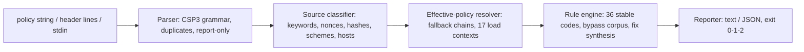

# cspdoctor

[English](README.md) | [中文](README.zh.md) | [日本語](README.ja.md)

[](LICENSE)   [](CONTRIBUTING.md)

**An open-source, zero-dependency Content-Security-Policy linter that flags 'unsafe-inline', wildcards and missing directives — a dedicated CSP parser with an actionable fix and a stable exit code for every finding.**


```bash
# not yet on npm — install from a checkout of this repository
npm install && npm run build && npm pack
npm install -g ./cspdoctor-0.1.0.tgz
```

## Why cspdoctor?

Writing a correct CSP is notoriously hard, and the failure mode is silent: the grammar has footguns (an unquoted `unsafe-inline` becomes a host source that will never exist; `'none'` next to anything is ignored; duplicate directives are not merged), the fallback semantics are counterintuitive (`worker-src` falls back through `child-src` *and* `script-src`, while `base-uri`, `form-action` and `frame-ancestors` never fall back at all), and a policy that looks strict can be a no-op that ships to production. Header scanners only tell you the header exists; online evaluators grade it in a browser tab, far away from the CI job that deploys it. cspdoctor is a dedicated, offline CSP parser and rule engine: it parses the policy the way browsers do, resolves the *effective* policy first, grades 36 stable-coded rules against real exploitability — `default-src *` is an error while it governs scripts and degrades once stricter directives override it — attaches a concrete fix to every finding, and returns exit codes a pipeline can gate on.

|  | cspdoctor | csp-evaluator | Mozilla Observatory | securityheaders.com |
|---|---|---|---|---|
| Focus | CSP only: parse + lint + explain | CSP checks (web UI / library) | whole-site grading | header presence scan |
| Where it runs | your terminal and CI, fully offline | browser tab; lib inside a JS bundle | hosted service | hosted service |
| Effective-policy grading (fallback chains) | yes — severity follows what a source really governs | partial | no | no |
| Fix attached to every finding | yes, copy-pasteable | partial | generic advice | generic advice |
| Rule docs offline | `cspdoctor explain <anything>` | no | linked web docs | linked web docs |
| CI exit codes | 0/1/2 with `--fail-on` | library return values | no | no |
| Runtime dependencies | 0 | Closure library stack | n/a (hosted) | n/a (hosted) |

<sub>Capability notes checked against each project's public documentation, 2026-07.</sub>

## Features

- **Parses CSP the way browsers do** — the CSP3 semicolon/whitespace grammar, case rules, first-duplicate-wins; the classic `script-src unsafe-inline` (quotes forgotten) is caught as the dead host source it really became (E101).
- **Grades the effective policy, not the text** — fallback chains are resolved before severity is assigned, so a wildcard is an error where it governs scripts, workers, plugins or `<base>`, a warning where it enables exfiltration or framing, and a notice in `img-src`.
- **A fix on every finding** — 36 stable-coded rules (E1xx/W2xx/I3xx), each with a copy-pasteable remediation; typos in keywords and directives get a did-you-mean.
- **Knows the bypass literature** — nonce entropy (W213), `'strict-dynamic'` without a nonce (E106), neutralized `'unsafe-inline'` reported honestly (I301), and a curated corpus of JSONP/AngularJS/user-content hosts that defeat allowlists (W215).
- **Three subcommands** — `check` lints; `coverage` prints which directive actually governs each of 17 load contexts; `explain` documents every rule, directive and keyword, offline.
- **Built for CI, zero dependencies** — deterministic output, `--format json`, `--fail-on error|warning|info|never`, exit codes 0/1/2; Node.js is the only requirement and the tool never opens a socket.

## Quickstart

Install:

```bash
# not yet on npm — install from a checkout of this repository
npm install && npm run build && npm pack
npm install -g ./cspdoctor-0.1.0.tgz
```

Check a saved response (`examples/weak.txt` — the header name is stripped automatically):

```bash
cspdoctor check --file examples/weak.txt
```

Output (real captured run, abridged to 5 of the 12 findings):

```text
policy 1 (enforced): 5 directives — 5 errors, 4 warnings, 3 info

  error E101 style-src › unsafe-inline
      unsafe-inline has no quotes, so browsers read it as a host named "unsafe-inline" — the keyword is not in effect
      fix: write 'unsafe-inline' (with quotes) if you meant the keyword — then rerun to see what the quoted form implies

  error E110 script-src › 'unsafe-inline'
      'unsafe-inline' lets every injected <script>, event handler and javascript: URL run — it turns off the XSS protection CSP exists to provide
      fix: move inline code to nonced or hashed scripts; once a nonce/hash is present, 'unsafe-inline' becomes a harmless legacy fallback

  error E113 script-src › https:
      https: is not "HTTPS only" — it allows every HTTPS origin on the internet to supply scripts, script elements, event handlers, workers
      fix: replace https: with the specific origins you load from

  warning W215 script-src › ajax.googleapis.com
      ajax.googleapis.com is a known CSP bypass in a script context — it hosts AngularJS and other gadget-rich libraries
      fix: self-host the files you need, or move to nonces + 'strict-dynamic' so the host allowlist stops mattering

  warning W207 base-uri (not set)
      base-uri is not set (it never falls back to default-src) — one injected <base> tag rebases every relative script URL to an attacker's origin
      fix: add: base-uri 'none' (or base-uri 'self' if you use <base>)

cspdoctor: FAIL — 5 errors, 4 warnings, 3 info (fail-on: warning)
```

Exit code 1 — drop it into CI as-is. The strict-CSP twin `examples/strict.txt` exits 0 with two info-level notices explaining *why* its inert-looking sources are correct. To see what actually governs each load context (real captured run, abridged):

```bash
cspdoctor coverage "default-src 'self'; script-src 'nonce-Xu3Xkw5rlPX2Jkyu' 'strict-dynamic'"
```

```text
effective coverage (policy 1)

  directive        governed by     sources
  script-src       script-src      'nonce-Xu3Xkw5rlPX2Jkyu' 'strict-dynamic'
  ...
  worker-src       -> script-src   'nonce-Xu3Xkw5rlPX2Jkyu' 'strict-dynamic'
  object-src       -> default-src  'self'
  base-uri         (unset)         unrestricted
  ...
  form-action      (unset)         unrestricted
  frame-ancestors  (unset)         unrestricted (header-only directive)
```

More scenarios (a legacy allowlist policy, a CI gate script) live in [examples/](examples/README.md).

## Rules

Errors (E1xx) mean the policy is weaker than written or holds XSS open; warnings (W2xx) mean browsers ignore something or a named defense is missing; info (I3xx) covers hardening tips and honest "this is fine, here is why" notices. Codes are stable API, never renumbered. Highlights below; the full catalog with rationale is in [docs/rules.md](docs/rules.md), and `cspdoctor explain <code>` prints it offline.

| Rule | Severity | Flags |
|---|---|---|
| E101 | error | keyword written without quotes — parsed as a host source |
| E106 | error | `'strict-dynamic'` with no nonce/hash: all scripts blocked |
| E110 / E111 | error | `'unsafe-inline'` / `'unsafe-eval'` where they govern scripts |
| E112 / E113 | error | `*` or `https:`/`data:`/`blob:` governing scripts, workers, plugins, `<base>` |
| E114 / E115 | error | scripts / plugin content entirely unrestricted |
| W202 / W206 | warning | duplicate directive ignored / dead `'none'` |
| W207–W209 | warning | missing `base-uri`, `frame-ancestors`, `form-action` (they never fall back) |
| W213 / W215 | warning | weak nonce entropy / known JSONP-CDN bypass host allowlisted |
| I301 / I302 | info | `'unsafe-inline'` or the allowlist correctly neutralized (strict-CSP pattern) |
| I309 | info | policy is Report-Only: nothing is enforced |

## CLI reference

`cspdoctor check` accepts a quoted policy string, `--file <path>` (raw value or saved header lines — `Content-Security-Policy[-Report-Only]:` names are stripped, comma-combined values split per RFC 9110), or `-` for stdin. `coverage` takes the same input; `explain` takes a topic.

| Flag | Default | Effect |
|---|---|---|
| `--fail-on <level>` | `warning` | exit 1 at or above `error`, `warning`, `info`; `never` always exits 0 |
| `--format text\|json` | `text` | report format; JSON is a stable shape for CI |
| `--context header\|meta` | `header` | `<meta>` delivery: flags directives browsers ignore there (W204) |
| `--file <path>` | — | read policy/headers from a file; repeatable |
| `-q, --quiet` | off | per-policy summary lines only |

Exit codes: `0` no findings at/above `--fail-on`, `1` findings, `2` usage or input error — so a pipeline can tell a weak policy from a broken invocation.

## Architecture



## Roadmap

- [x] CSP3 parser, effective-policy grading, 36-rule catalog with fixes, `coverage` + `explain` subcommands, JSON output (v0.1.0)
- [ ] `--fix`: emit a corrected policy with the safe rewrites applied
- [ ] Value grammar for non-source-list directives (`sandbox` flags, `trusted-types`, `webrtc`)
- [ ] `cspdoctor diff <old> <new>`: review-friendly policy diffing
- [ ] Cross-policy view: grade what multiple delivered policies enforce *together*

See the [open issues](https://github.com/JaydenCJ/cspdoctor/issues) for the full list.

## Contributing

Contributions are welcome. Build with `npm install && npm run build`, then run `npm test` (90 tests) and `bash scripts/smoke.sh` (must print `SMOKE OK`) — this repository ships no CI, every claim above is verified by local runs. See [CONTRIBUTING.md](CONTRIBUTING.md), grab a [good first issue](https://github.com/JaydenCJ/cspdoctor/issues?q=is%3Aissue+is%3Aopen+label%3A%22good+first+issue%22), or start a [discussion](https://github.com/JaydenCJ/cspdoctor/discussions).

## License

[MIT](LICENSE)
