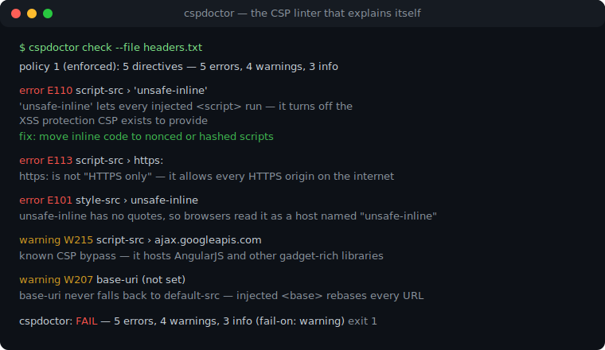
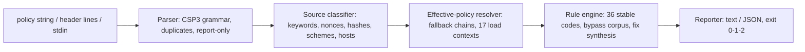

# cspdoctor

[English](README.md) | [中文](README.zh.md) | [日本語](README.ja.md)

[](LICENSE)   [](CONTRIBUTING.md)

**开源、零依赖的 Content-Security-Policy 检查器，专抓 'unsafe-inline'、通配符与缺失指令 —— 一个专职的 CSP 解析器，每条发现都附带可执行的修复建议和稳定的退出码。**



```bash
# not yet on npm — install from a checkout of this repository
npm install && npm run build && npm pack
npm install -g ./cspdoctor-0.1.0.tgz
```

## 为什么选 cspdoctor？

写出一份正确的 CSP 出了名地难，而且失败方式是无声的：语法里全是坑（忘了引号的 `unsafe-inline` 会变成一个永远不存在的主机源；`'none'` 只要旁边有别的源就被忽略；重复指令不会被合并），回退语义违反直觉（`worker-src` 会依次回退到 `child-src` *和* `script-src`，而 `base-uri`、`form-action`、`frame-ancestors` 根本不回退），一份看起来很严的策略可能是个空转的摆设并被直接发上生产。响应头扫描器只告诉你这个头存在；在线评估器在浏览器标签页里打分，离真正部署它的 CI 十万八千里。cspdoctor 是一个专职、离线的 CSP 解析器加规则引擎：按浏览器的方式解析策略，先解析出*生效*策略，再用 36 条稳定编码的规则按真实可利用性打分 —— `default-src *` 在它管辖脚本时是 error，被更严的指令覆盖后自动降级 —— 每条发现都附上具体修复，并返回流水线可以直接把关的退出码。

|  | cspdoctor | csp-evaluator | Mozilla Observatory | securityheaders.com |
|---|---|---|---|---|
| 关注点 | 只做 CSP：解析 + 检查 + 讲解 | CSP 检查（网页 UI / 库） | 整站评分 | 响应头存在性扫描 |
| 运行位置 | 你的终端和 CI，完全离线 | 浏览器标签页；库要打进 JS bundle | 托管服务 | 托管服务 |
| 生效策略打分（回退链） | 有 —— 严重度跟随源真正管辖的范围 | 部分 | 无 | 无 |
| 每条发现附修复 | 有，可直接复制 | 部分 | 泛泛建议 | 泛泛建议 |
| 离线规则文档 | `cspdoctor explain <anything>` | 无 | 链接到网页文档 | 链接到网页文档 |
| CI 退出码 | 0/1/2，可配 `--fail-on` | 库的返回值 | 无 | 无 |
| 运行时依赖 | 0 | Closure 库全家桶 | 不适用（托管） | 不适用（托管） |

<sub>各项能力对照自各项目公开文档，2026-07 核对。</sub>

## 功能

- **按浏览器的方式解析 CSP** —— CSP3 的分号/空白语法、大小写规则、重复指令取首条；经典的 `script-src unsafe-inline`（忘了引号）会被按它真实变成的死主机源抓出来（E101）。
- **给生效策略打分，而不是给文本打分** —— 先解析回退链再定严重度：通配符在管辖脚本、worker、插件或 `<base>` 处是 error，在能外传数据或被嵌框处是 warning，在 `img-src` 里只是提示。
- **每条发现都有修复** —— 36 条稳定编码规则（E1xx/W2xx/I3xx），条条附可复制的整改方案；关键字和指令的手误还有 did-you-mean。
- **熟读绕过文献** —— nonce 熵值（W213）、没有 nonce 的 `'strict-dynamic'`（E106）、被中和的 `'unsafe-inline'` 如实报告（I301），外加一份精选的 JSONP/AngularJS/用户内容主机语料，专治白名单绕过（W215）。
- **三个子命令** —— `check` 检查；`coverage` 打印 17 个加载上下文各由哪条指令真正管辖；`explain` 离线讲解每条规则、指令和关键字。
- **为 CI 而生，零依赖** —— 输出确定性、`--format json`、`--fail-on error|warning|info|never`、退出码 0/1/2；只需要 Node.js，工具从不打开任何套接字。

## 快速上手

安装：

```bash
# not yet on npm — install from a checkout of this repository
npm install && npm run build && npm pack
npm install -g ./cspdoctor-0.1.0.tgz
```

检查一份保存下来的响应（`examples/weak.txt` —— 头名会被自动剥掉）：

```bash
cspdoctor check --file examples/weak.txt
```

输出（真实运行记录，节选 12 条发现中的 5 条）：

```text
policy 1 (enforced): 5 directives — 5 errors, 4 warnings, 3 info

  error E101 style-src › unsafe-inline
      unsafe-inline has no quotes, so browsers read it as a host named "unsafe-inline" — the keyword is not in effect
      fix: write 'unsafe-inline' (with quotes) if you meant the keyword — then rerun to see what the quoted form implies

  error E110 script-src › 'unsafe-inline'
      'unsafe-inline' lets every injected <script>, event handler and javascript: URL run — it turns off the XSS protection CSP exists to provide
      fix: move inline code to nonced or hashed scripts; once a nonce/hash is present, 'unsafe-inline' becomes a harmless legacy fallback

  error E113 script-src › https:
      https: is not "HTTPS only" — it allows every HTTPS origin on the internet to supply scripts, script elements, event handlers, workers
      fix: replace https: with the specific origins you load from

  warning W215 script-src › ajax.googleapis.com
      ajax.googleapis.com is a known CSP bypass in a script context — it hosts AngularJS and other gadget-rich libraries
      fix: self-host the files you need, or move to nonces + 'strict-dynamic' so the host allowlist stops mattering

  warning W207 base-uri (not set)
      base-uri is not set (it never falls back to default-src) — one injected <base> tag rebases every relative script URL to an attacker's origin
      fix: add: base-uri 'none' (or base-uri 'self' if you use <base>)

cspdoctor: FAIL — 5 errors, 4 warnings, 3 info (fail-on: warning)
```

退出码 1 —— 原样丢进 CI 即可。严格 CSP 的孪生样例 `examples/strict.txt` 以 0 退出，只带两条 info 级说明，解释它那些看似无用的源*为什么*是对的。想看每个加载上下文实际归谁管（真实运行记录，节选）：

```bash
cspdoctor coverage "default-src 'self'; script-src 'nonce-Xu3Xkw5rlPX2Jkyu' 'strict-dynamic'"
```

```text
effective coverage (policy 1)

  directive        governed by     sources
  script-src       script-src      'nonce-Xu3Xkw5rlPX2Jkyu' 'strict-dynamic'
  ...
  worker-src       -> script-src   'nonce-Xu3Xkw5rlPX2Jkyu' 'strict-dynamic'
  object-src       -> default-src  'self'
  base-uri         (unset)         unrestricted
  ...
  form-action      (unset)         unrestricted
  frame-ancestors  (unset)         unrestricted (header-only directive)
```

更多场景（老式白名单策略、CI 把关脚本）见 [examples/](examples/README.md)。

## 规则

Error（E1xx）意味着策略比字面更弱、或者 XSS 的门还开着；warning（W2xx）意味着浏览器会忽略某些写法、或某道有名有姓的防线缺失；info（I3xx）是加固建议和诚实的"这没问题，原因如下"式说明。规则码是稳定 API，永不重编号。以下为精选；带原理的完整目录见 [docs/rules.md](docs/rules.md)，`cspdoctor explain <code>` 可离线打印。

| 规则 | 严重度 | 检查内容 |
|---|---|---|
| E101 | error | 关键字没加引号 —— 被解析成主机源 |
| E106 | error | `'strict-dynamic'` 没有 nonce/hash：所有脚本被拦 |
| E110 / E111 | error | `'unsafe-inline'` / `'unsafe-eval'` 在其管辖脚本之处 |
| E112 / E113 | error | `*` 或 `https:`/`data:`/`blob:` 管辖脚本、worker、插件、`<base>` |
| E114 / E115 | error | 脚本 / 插件内容完全不设防 |
| W202 / W206 | warning | 重复指令被忽略 / 无效的 `'none'` |
| W207–W209 | warning | 缺 `base-uri`、`frame-ancestors`、`form-action`（它们从不回退） |
| W213 / W215 | warning | nonce 熵不足 / 白名单放行了已知 JSONP-CDN 绕过主机 |
| I301 / I302 | info | `'unsafe-inline'` 或白名单被正确中和（严格 CSP 模式） |
| I309 | info | 策略是 Report-Only：什么都不会被拦 |

## CLI 参考

`cspdoctor check` 接受带引号的策略字符串、`--file <path>`（原始值或保存的响应头行 —— `Content-Security-Policy[-Report-Only]:` 头名会被剥掉，逗号合并的值按 RFC 9110 拆开），或用 `-` 读 stdin。`coverage` 输入相同；`explain` 接受一个主题。

| 旗标 | 默认 | 效果 |
|---|---|---|
| `--fail-on <level>` | `warning` | 达到 `error`、`warning`、`info` 即退出 1；`never` 恒为 0 |
| `--format text\|json` | `text` | 报告格式；JSON 形状稳定，供 CI 使用 |
| `--context header\|meta` | `header` | `<meta>` 投放：标出浏览器在那里会忽略的指令（W204） |
| `--file <path>` | — | 从文件读策略/响应头；可重复 |
| `-q, --quiet` | 关 | 只输出每个策略的摘要行 |

退出码：`0` 没有达到 `--fail-on` 的发现，`1` 有发现，`2` 用法或输入错误 —— 流水线由此能区分"策略弱"和"命令敲错"。

## 架构



## 路线图

- [x] CSP3 解析器、生效策略打分、36 条带修复的规则目录、`coverage` + `explain` 子命令、JSON 输出（v0.1.0）
- [ ] `--fix`：应用安全改写后输出修正版策略
- [ ] 非源列表指令的取值语法（`sandbox` 标志、`trusted-types`、`webrtc`）
- [ ] `cspdoctor diff <old> <new>`：便于评审的策略对比
- [ ] 跨策略视图：给多份并发投放的策略*合起来*的效果打分

完整列表见 [open issues](https://github.com/JaydenCJ/cspdoctor/issues)。

## 参与贡献

欢迎贡献。先 `npm install && npm run build` 构建，再跑 `npm test`（90 个测试）和 `bash scripts/smoke.sh`（必须打印 `SMOKE OK`）—— 本仓库不带 CI，上面每一条断言都靠本地运行验证。参见 [CONTRIBUTING.md](CONTRIBUTING.md)，认领一个 [good first issue](https://github.com/JaydenCJ/cspdoctor/issues?q=is%3Aissue+is%3Aopen+label%3A%22good+first+issue%22)，或发起 [discussion](https://github.com/JaydenCJ/cspdoctor/discussions)。

## 许可证

[MIT](LICENSE)
